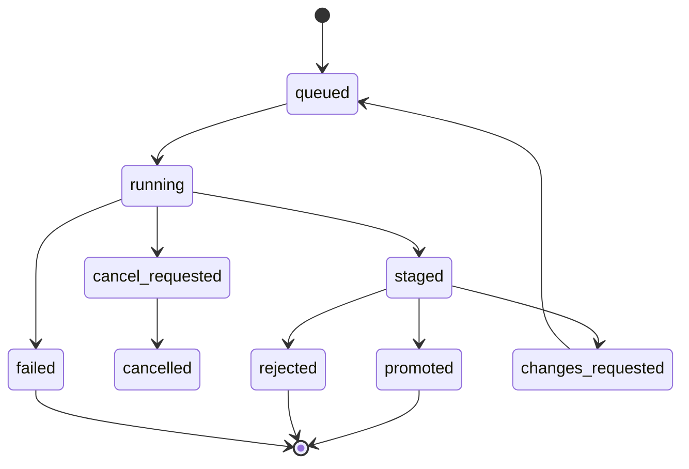

# HAL 9000 Rebuild Plan

This plan turns HAL 9000 from a local PDF assistant into a firm-wide research
platform with shared memory, repeatable agent workflows, and reviewable outputs.

## Rebuild Completion Checklist

### Completed

- [x] Define the autoresearch-style `program.md` contract.
- [x] Add `hal9000.research` parsing and validation.
- [x] Add CLI commands to initialize and validate research programs.
- [x] Add MkDocs pages for the firm-wide research OS, rebuild plan, and research programs.
- [x] Add shared-store SQLAlchemy models for projects, programs, runs, chunks, claims, evidence, outputs, and review decisions.
- [x] Add `ResearchStore` as the clean repository/service layer over shared-store tables.
- [x] Add CLI commands to create projects, save programs, and queue research runs.
- [x] Harden acquisition relevance fallback so low-scoring searches return best candidates with warnings instead of silently returning nothing.
- [x] Add append-only research run events for orchestration logs.
- [x] Add CLI commands to inspect run logs and advance run state.
- [x] Define two initial dogfood research programs.
- [x] Dogfood the initial research programs against the shared store with real queued runs.
- [x] Add first output generator that stages required outputs through `ResearchStore`.
- [x] Add concrete first-pass output renderers for literature briefs, evidence tables, open questions, ADAM context JSON, hypothesis cards, and experiment suggestions.
- [x] Add first bounded worker entry point that executes queued runs through staged outputs and run reports.
- [x] Add Alembic migration setup and initial schema migration.
- [x] Add local object-store abstraction for canonical artifacts.
- [x] Standardize production on managed Postgres via `postgresql+psycopg://...`.
- [x] Add S3-compatible object storage backend with stable `s3://...` URIs.
- [x] Select pgvector-first vector path for v1 retrieval.
- [x] Add embedding provider abstraction with deterministic fake embeddings.
- [x] Add chunk embedding records and migration support.
- [x] Add semantic search service over chunk embeddings.
- [x] Wire semantic retrieval context into bounded worker output staging.
- [x] Add first corpus preparation pipeline for completed documents: chunking, embeddings, first-pass claims, retrieval, and staged outputs.
- [x] Add durable tool-call accounting records for bounded worker tools.
- [x] Add budget/tool-policy checks around live acquisition.
- [x] Connect live acquisition/search/download execution into the worker behind `execute-run --live-acquisition`.
- [x] Add runtime budget checks around major worker phases.
- [x] Add LLM-call budget enforcement and `llm.call` tool-call records during RLM processing.
- [x] Add acquisition progress telemetry events during live worker acquisition.
- [x] Add per-paper acquisition telemetry for searched, downloaded, processed, skipped, and failed papers.
- [x] Add reviewer-facing run telemetry summaries over events, tool calls, acquisition outcomes, budgets, warnings, and staged outputs.
- [x] Add review workflow commands/API for promote, reject, and request changes.
- [x] Add environment profiles for local, staging, and production.
- [x] Add seed/bootstrap commands for firm projects and starter programs.
- [x] Add retry, cancellation, and timeout handling for worker execution.
- [x] Add queued worker execution command for scheduler/process-manager deployments.
- [x] Add observability CLI/API summary for run status, queue health, tool calls, costs, failures, and worker outcomes.
- [x] Add deployment manifests for gateway, worker, docs, Postgres, and S3-compatible object storage.
- [x] Add firm-wide export targets for ADAM, Obsidian, Markdown, JSON, and dashboards.
- [x] Add backup/restore plan for Postgres and object storage.
- [x] Add foundational users, teams, memberships, and project permission grants.
- [x] Add project permission enforcement for review service/API entry points.
- [x] Add SSO/OIDC planning and verified-claim to user/team mapping.
- [x] Add comments and annotations on outputs and claims for review UI workflows.
- [x] Add lightweight HTTP adapter and browser review UI for authorized review workflows.
- [x] Add corpus hardening fields and service for document versioning, refresh policy, citation normalization, source quality, and dedupe reports.
- [x] Extend semantic search beyond chunks to extracted claims and research outputs.
- [x] Add graph relationship records for cites, supports, contradicts, uses method, studies material, and reports property.
- [x] Replace first-pass output renderers with source-rich citation renderers and add output versioning/diffing.
- [x] Add collections, saved searches, shared project views, notification records, and audit views.

### Remaining

- [ ] Add scheduled source refresh execution and claim-level dedupe reports.
- [ ] Add richer figure/table extraction and export rendering.
- [ ] Add HTTP deployment polish for Slack/Sheets production app webhooks.
- [ ] Add retention, secrets-management, compliance, CI, and release-process hardening.

## Master Completion Checklist

### Phase A: Platform Foundation

- [x] Establish MkDocs as the engineering share-out surface.
- [x] Define the rebuild plan and progress tracker.
- [x] Add the autoresearch-style program contract.
- [x] Add shared-store schema and repository service layer.
- [x] Add Alembic migrations and migration documentation.
- [x] Decide managed Postgres as the production system of record.
- [x] Add environment profiles for local, staging, and production.
- [x] Add seed/bootstrap commands for firm projects and starter programs.

### Phase B: Shared Corpus and Provenance

- [x] Reuse existing `Document` records as first source-document records.
- [x] Add canonical chunks, claims, evidence links, and run outputs.
- [x] Add provenance fields for programs, runs, claims, outputs, and events.
- [x] Add local object storage for PDFs, extracted text, tables, figures, and output artifacts.
- [x] Select S3-compatible production object storage and boto3 credential resolution.
- [x] Add S3-compatible object store backend.
- [x] Add document versioning and source refresh policy metadata.
- [x] Add citation normalization and source quality fields.
- [x] Add persisted deduplication reports for documents.
- [ ] Add scheduled source refresh execution.
- [ ] Add claim-level deduplication reports.

### Phase C: Retrieval and Knowledge Layer

- [x] Decide pgvector-first versus dedicated vector DB.
- [x] Add chunk embedding record workflow.
- [x] Add semantic search service over chunks.
- [x] Extend semantic search service over claims and outputs.
- [x] Add graph relationship tables and service for cites, supports, contradicts, uses method, studies material, and reports property.
- [x] Add retrieval tests over a representative local corpus slice.

### Phase D: Agent Programs and Orchestration

- [x] Define validated research program templates.
- [x] Add two dogfood programs: literature review and ADAM experiment context.
- [x] Queue, inspect, log, and advance research runs from the CLI.
- [x] Add append-only run events.
- [x] Add bounded worker execution for queued runs.
- [x] Add retrieval context attachment to bounded worker execution.
- [x] Connect completed document ingestion, chunking, first-pass claim extraction, embeddings, retrieval, and output generation into one worker flow.
- [x] Add budget enforcement for acquisition papers/downloads.
- [x] Add tool-call records and first-pass cost accounting fields.
- [x] Connect live acquisition/search/download execution into the worker.
- [x] Add budget enforcement for runtime and LLM calls.
- [x] Add richer acquisition processing telemetry for per-document outcomes and failures.
- [x] Add reviewer-facing run telemetry views and summaries.
- [x] Add retry, cancellation, and timeout handling.
- [x] Add scheduled or queued worker process.

### Phase E: Output Framework

- [x] Stage outputs through `ResearchStore`.
- [x] Generate run reports from event logs.
- [x] Render first-pass literature briefs, evidence tables, open questions, ADAM contexts, hypothesis cards, and experiment suggestions.
- [x] Replace first-pass renderers with source-rich renderers using real extracted claims, citations, and figures.
- [x] Add ADAM context schema validation.
- [x] Add Obsidian/Markdown export from canonical outputs.
- [x] Add JSON export API for dashboards and downstream tools.
- [x] Add output versioning and diffing.
- [x] Add source-rich renderers using real citations, extracted claims, and first figure/table references.
- [ ] Add richer figure/table extraction and export rendering.

### Phase F: Collaboration and Review

- [x] Add staged outputs and review decisions in the data model.
- [x] Add review workflow commands/API: promote, reject, request changes.
- [x] Add authorized review queue/detail/decision service API.
- [x] Add comments and annotations on outputs and claims.
- [x] Add lightweight browser review UI and HTTP adapter over review services.
- [x] Add collections, saved searches, and shared project views.
- [x] Add notification records and review-ready notification hooks.
- [x] Add audit views for run history and promotion decisions.
- [x] Add notification delivery workers for Slack/email/Sheets.
- [x] Add richer browser audit dashboards.

### Phase G: Firmwide Access and Governance

- [x] Add users, teams, roles, and permissions.
- [x] Add SSO/OIDC integration plan.
- [x] Add project visibility and access enforcement for review workflows.
- [ ] Add retention policy for PDFs, artifacts, and logs.
- [ ] Add secrets management for providers and model APIs.
- [ ] Add compliance review for copyrighted PDFs and generated summaries.

### Phase H: Deployment and Operations

- [ ] Package API/gateway, worker, scheduler, and docs services.
- [x] Add Docker/Compose for local firmwide stack.
- [x] Add production deployment manifests.
- [x] Add observability: run metrics, queue metrics, cost, errors, latency.
- [x] Add backup/restore plan for Postgres and object storage.
- [ ] Add CI checks for tests, docs, migrations, and lint/type checks.
- [ ] Add release process and changelog.

### Phase I: Non-CLI App Surfaces

- [x] Add first notification delivery workers for in-app, Slack webhook, SMTP email, and Sheets-compatible CSV sync.
- [x] Add first Slack app service contract for firm-wide research interaction.
- [ ] Add Slack channel workflow for `#hal-9000-dev`, run summaries, export links, and HTTP event endpoints.
- [x] Add Slack commands/buttons for queueing runs, checking run status, opening review detail, adding comments, and promoting/requesting changes.
- [x] Add Google Sheets sync jobs for non-CLI run trackers, review queues, outputs, and audit dashboards.
- [ ] Add Sheets writeback actions for comments, decisions, and run queueing.
- [x] Add permissions mapping so Slack and Sheets actions use the same OIDC/user/team/project access model as HAL services.
- [x] Add first HTTP app gateway routes for Slack slash commands and button actions.

## Full-Team Demo Readiness Checklist

- [x] Seed a repeatable demo project, users, staged run, source document, chunks, embeddings, claims, outputs, comments, notifications, saved views, and audit trail with `hal research demo-seed`.
- [x] Demo flow shows memory search, browser review, Slack command/action contracts, Sheets sync rows, and audit history.
- [x] Browser review UI exposes queue, output detail, comments, review decisions, and audit dashboard.
- [x] Slack commands/actions can run from CLI and first HTTP app gateway routes.
- [x] Sheets project cockpit rows can be generated through `hal research sync-sheets`.
- [ ] Create an actual demo Google Sheet, grant team visibility, and sync `runs`, `review_queue`, `outputs`, and `audit` tabs.
- [ ] Configure Slack app request URLs against the HTTP app gateway and verify signatures in a staging tunnel.
- [ ] Run clean verification immediately before the demo: `pytest`, `mkdocs build --strict`, migration smoke, review UI smoke.
- [ ] Prepare the leadership story: queue/run memory -> staged output -> review UI -> Slack action -> Sheets dashboard -> audit trail.

## Milestone 1: Research Program Contract

Status: implemented.

Deliverables:

- Add `hal9000.research` package.
- Define validated `program.md` front matter.
- Add CLI commands to create and validate research programs.
- Document the program model in MkDocs.

Why this comes first: agent orchestration needs a durable contract for objective,
scope, budget, tools, and required outputs.

## Milestone 2: Canonical Store Interfaces

Status: started.

Deliverables:

- Add first canonical SQLAlchemy models for shared research projects, programs, runs, chunks, claims, evidence links, outputs, and review decisions.
- Introduce store interfaces for metadata, object storage, vector search, and graph relationships.
- Keep SQLite-compatible local development, but design toward Postgres.
- Add provenance fields to documents, chunks, claims, outputs, and run records.
- Create migrations before changing production schemas.

Initial entities:

- `ResearchProject`
- `ResearchProgramRecord`
- `ResearchRun`
- existing `Document` as the first source-document record
- `DocumentChunk`
- `ExtractedClaim`
- `EvidenceLink`
- `ResearchOutput`
- `ReviewDecision`

Implemented in this slice:

- Shared-store SQLAlchemy tables are created by `init_db`.
- Relationship coverage is tested for project -> program -> run -> output -> review.
- Evidence lineage is tested for document -> chunk -> claim -> evidence.
- JSON payloads remain text columns for SQLite compatibility, while production database URLs are standardized on `postgresql+psycopg://...`.
- `ResearchStore` now provides a clean service layer over the new tables.
- Search relevance fallback is covered by tests so acquisition does not silently return zero papers when all scored results miss the configured threshold.
- CLI commands can create projects, persist programs, and queue runs through `ResearchStore`.
- `ResearchRunEvent` provides ordered append-only run logs.
- `ResearchStore` can append run events, list run events, and update run status with lifecycle events.
- CLI commands can list runs, show run logs, append run events, and advance run status.
- Two checked-in dogfood programs exist: source-backed literature review and ADAM experiment context builder.
- `ResearchOutputGenerator` can stage all required outputs from a program contract and produce a run report.
- Dogfood tests walk both starter programs through save -> queue -> running -> staged with outputs and run logs.
- Concrete first-pass renderers now produce source-aware Markdown/JSON outputs from run claims.
- `BoundedResearchWorker` executes queued runs through running -> staged and records worker events.
- The storage layer supports local files and S3-compatible buckets through the same `ObjectStore` protocol.
- The first vector layer adds deterministic fake embeddings, `chunk_embeddings`, and pgvector-oriented migration support.
- `VectorRepository` can search embedded chunks by cosine similarity, and `hal research search-chunks` exposes the first semantic memory query path.
- `BoundedResearchWorker` attaches top retrieved project chunks as run context before staging contract outputs.
- `ResearchCorpusPipeline` prepares completed documents for runs by chunking text, embedding chunks, extracting first-pass claims, and feeding outputs in the same worker execution.
- `ResearchToolCall` records now track auditable worker tool invocations, starting with live acquisition.
- `BoundedResearchWorker` can run live acquisition through `hal research execute-run --live-acquisition`, constrained by run budget and tool policy.
- Runtime budget is checked before major worker phases, and RLM model calls emit `llm.call` tool-call records before provider execution.
- Live acquisition emits `acquisition.progress` run events for search, download, and processing stages.
- Acquisition results now include a per-paper event ledger, and workers mirror those into `acquisition.paper.*` run events.
- `RunTelemetrySummarizer` and `hal research run-summary` now provide a compact reviewer view over run events, tool calls, acquisition outcomes, budget usage, warnings, staged outputs, and reviewer notes.
- `ResearchStore.review_run_outputs` and `hal research review-run` now record reviewer decisions across staged outputs and advance runs to `promoted`, `rejected`, or `changes_requested`.
- `local`, `staging`, and `production` profiles now provide explicit operating defaults for database, object storage, vector retrieval, gateway binding, and readiness checks.
- `hal research bootstrap` now creates or reuses the baseline firm research project and starter programs idempotently.
- `BoundedResearchWorker` now supports bounded phase retries, cancellation acknowledgement, and phase timeout accounting.
- `hal research work-queue` now executes queued runs once, providing the first scheduler/process-manager entry point.
- `ResearchObservabilityService` and `hal research observe` now summarize run status counts, queue health, tool-call cost/failure state, recent worker outcomes, recent failures, and recent runs.
- `Dockerfile` and `deploy/compose.yaml` now define the first deployable stack for gateway, queue worker, docs, Postgres/pgvector, and MinIO object storage.
- `ResearchOutputExporter` and `hal research export-run/export-project` now publish promoted outputs to ADAM, Obsidian, Markdown, JSON, and dashboard object-store artifacts.
- `docs/guides/backup-restore.md` now defines the first Postgres and object-storage backup/restore runbook.
- `UserAccount`, `Team`, `TeamMembership`, and `ProjectPermission` now provide the first durable governance model for project access.
- `ResearchAuthorizer` and `ResearchReviewService` now enforce reviewer access for review queue, detail, and decision workflows.
- `OIDCIdentityMapper` now maps verified OIDC claims into HAL users, global admin role, and HAL team memberships.
- `ReviewAnnotationService` now supports authorized comments and annotations on outputs and extracted claims.
- `hal research review-ui` now runs a lightweight HTTP review surface over the authorized queue, detail, comment, and decision services.
- `CorpusHardeningService`, `hal research harden-corpus`, and `hal research dedupe-report` now attach stable source/version/citation/quality metadata and persist duplicate-document reports.
- `VectorRepository.search_memory` and `hal research search-memory` now search extracted claims and research outputs through the embedding provider contract.
- `ResearchGraphService`, `hal research add-graph-edge`, and `hal research graph-edges` now manage typed graph edges across documents, chunks, claims, outputs, and literal method/material/property/concept nodes.
- `ResearchOutputGenerator` now renders citation-marked briefs/tables/JSON from extracted claims and evidence, while `research_output_versions`, `hal research output-versions`, and `hal research diff-output` provide output history and review diffs.
- `CollaborationService` and CLI commands now manage collections, saved searches, shared views, review-ready notifications, notification lists, and audit-event views.
- `NotificationDeliveryService` and `hal research deliver-notifications` now process durable in-app, Slack webhook, SMTP email, and Sheets-compatible CSV notification queues.
- `SlackAppService`, `hal research slack-command`, and `hal research slack-action` now provide Slack slash-command/button contracts for queueing runs, status checks, review queues, comments, and review decisions.
- `SheetsSyncService` and `hal research sync-sheets` now sync runs, review queues, outputs, and audit rows to Google Sheets through the native Values API.
- `hal research review-ui` now includes an authorized audit dashboard with filters, counts, and event detail alongside queue, comments, and review decisions.

## Milestone 3: Research Run Orchestrator

Status: started.

Deliverables:

- Execute research programs as bounded runs.
- Track run status, budgets, tool calls, errors, and generated artifacts.
- Write append-only run logs.
- Stage outputs for review before promotion.

Initial run states:

## Milestone 4: Shared Deployment

Status: planned.

Deliverables:

- Deploy API, gateway, workers, database, object store, and vector index.
- Add authentication and team/project permissions.
- Add budget and rate controls for model/tool usage.
- Add observability for runs, queue health, cost, and failures.

## Milestone 5: Collaboration and Review

Status: started.

Deliverables:

- Add shared projects and collections.
- Add reviewer workflow for staged outputs. Initial CLI/API support exists for promote, reject, and request changes.
- Add comments, annotations, and output version history.
- Add export targets for ADAM, Obsidian, Markdown, JSON, and dashboards.

## Immediate Next Tasks

- Add scheduled source refresh execution and claim-level deduplication reports.
- Add production hardening for HTTP Slack routes and Google Sheets writeback workflows.
- Add richer figure/table extraction and export rendering.
- Add Slack app and `#hal-9000-dev` channel workflow for non-CLI team updates.
- Add Google Sheets writeback for non-CLI comments, review decisions, and run queueing.
- Add retention, secrets-management, compliance, CI, and release-process hardening.
