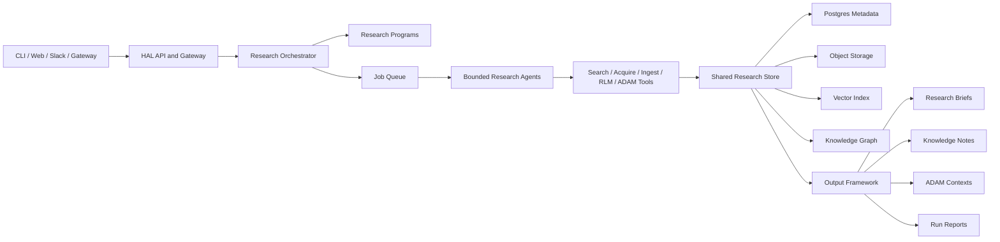

# Firm-Wide Research OS

HAL 9000 is being rebuilt as a firm-wide research operating system inspired by
Karpathy's `autoresearch` pattern: agent-readable programs, bounded autonomous
runs, objective output contracts, and append-only research logs.

The goal is not to copy the single-GPU training workflow. The goal is to apply
the same operating model to shared technical research:

- one collected research data store;
- many users, teams, and research agents;
- repeatable research programs instead of one-off chat sessions;
- source-backed outputs that can be reviewed, promoted, reused, and cited.

## Target Architecture



## Core Concepts

### Research Program

A research program is the HAL equivalent of `autoresearch`'s `program.md`.
It combines human-readable instructions with YAML front matter that defines
scope, budget, tools, output contracts, and promotion criteria.

Research programs make agent behavior reviewable before a run starts.

### Bounded Run

A bounded run is a single execution of a research program with explicit limits:
runtime, model/tool calls, maximum papers, maximum downloads, and required
review status.

This keeps autonomous work comparable, auditable, and affordable.

### Shared Research Store

The shared store is the canonical firm-wide memory. Local files and Obsidian
notes become outputs, not the source of truth.

The production target is:

- Managed Postgres for metadata, jobs, users, projects, provenance, and output records.
- S3-compatible object storage for PDFs, extracted text, figures, tables, and generated files.
- pgvector-first search for semantic retrieval across documents, chunks, claims, and outputs.
- Graph relationships for citations, evidence, methods, materials, and hypotheses.

The first implementation slice of the shared store adds these canonical records:

- `ResearchProject`: team-facing workspace for a research area.
- `ResearchProgramRecord`: persisted `program.md` contract.
- `ResearchRun`: bounded execution of a program.
- `ResearchRunEvent`: ordered append-only run log.
- `DocumentChunk`: reusable retrieval and extraction unit.
- `ChunkEmbedding`: chunk-level embedding metadata and portable vector payload.
- `ExtractedClaim`: source-backed claim staged for review.
- `EvidenceLink`: precise pointer to supporting source text or URLs.
- `ResearchOutput`: generated brief, evidence table, ADAM context, note, or report.
- `ReviewDecision`: promote, reject, or revise decision for staged outputs.

### Output Framework

HAL outputs should be standardized enough to collaborate on:

- paper records;
- research briefs;
- evidence tables;
- ADAM contexts;
- Obsidian-compatible notes;
- hypothesis cards;
- run reports.

Every output should link back to source evidence and the run that generated it.

## Current Implementation

HAL now has a validated research program format:

```bash
hal research init-program ./program.md \
  --name "Nickel Superalloy Review" \
  --objective "Identify evidence gaps in creep-resistant nickel superalloys."

hal research validate-program ./program.md
```

HAL also has the first shared-store database schema for projects, programs,
runs, chunks, claims, evidence, outputs, and review decisions. This gives the
future orchestrator a place to persist work before outputs are promoted into
firm knowledge.

The schema is accessed through `ResearchStore`, a small repository service that
keeps orchestration code from constructing raw SQLAlchemy relationships.
Run logs are stored as ordered `ResearchRunEvent` rows so every orchestrator or
worker action can leave an auditable trace.

The CLI can now create a shared project, save a validated program, and queue a
run record:

```bash
hal research create-project superalloys --name "Superalloys"
hal research save-program ./program.md --project-slug superalloys
hal research queue-run --program-id <saved-program-id>
hal research runs --project-slug superalloys
hal research run-log <run-id>
hal research update-run <run-id> --status running
hal research execute-run <run-id> --actor hal-worker
```

The repo also includes two validated starter programs in `templates/research/programs`:
one for source-backed literature reviews and one for ADAM experiment contexts.
Both are covered by a dogfood test that saves the programs, queues runs, advances
their lifecycle, stages required outputs, and writes run reports through the
shared store.

First-pass output renderers now produce research briefs, evidence tables, open
questions, ADAM contexts, hypothesis cards, and experiment suggestions from
claims and evidence attached to a run.

Database migrations are managed with Alembic. Local object storage provides
stable `hal-local://...` artifact URIs for developer runs, while the production
object store targets S3-compatible `s3://...` URIs. The first vector slice adds
chunk embedding records plus deterministic fake embeddings for tests so the
retrieval path can be built without binding HAL to one production embedding
vendor yet.

HAL also has its first semantic memory loop: embedded chunks can be searched
from the CLI, and bounded worker execution attaches top retrieved project chunks
to staged outputs as retrieval context. The first corpus pipeline can now turn
completed document text into chunks, embeddings, first-pass claims, retrieval
context, and reviewable outputs in one bounded worker run.

## Engineering Principles

- Store facts once and generate many views from the canonical store.
- Keep autonomous runs bounded by default.
- Separate staged agent outputs from promoted firm knowledge.
- Treat provenance as data, not prose.
- Preserve human review hooks where outputs affect decisions.
- Build local-first compatibility, but deploy shared-first.
