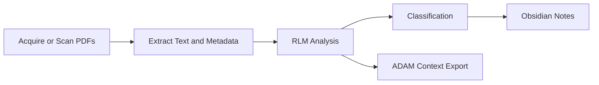

---
hide:
  - toc
---

# HAL 9000

HAL 9000 is a research assistant for technical PDFs. It acquires papers, analyzes them with an RLM-style pipeline, classifies topics, generates Obsidian notes, and builds ADAM-ready context exports.

[Start Here: Quick Start](guides/quick-start.md){ .md-button .md-button--primary }
[Full Setup Guide](guides/getting-started.md){ .md-button }

## What You Can Do

- Acquire papers from Semantic Scholar and arXiv.
- Process local PDFs into structured summaries and extracted metadata.
- Generate topic-linked notes in an Obsidian vault.
- Build ADAM context JSON files from batches of papers.
- Run a WebSocket gateway for integration clients.

## First Commands

```bash
# verify install
hal --help

# check current configuration and DB status
hal status

# preview papers on a topic (download nothing)
hal acquire "battery cathode materials" --dry-run

# process one local paper
hal process /absolute/path/to/paper.pdf
```

## Recommended Reading Order

1. [Quick Start](guides/quick-start.md)
2. [Getting Started](guides/getting-started.md)
3. [Configuration](guides/configuration.md)
4. [CLI Reference](guides/cli-reference.md)

## Core Workflow


